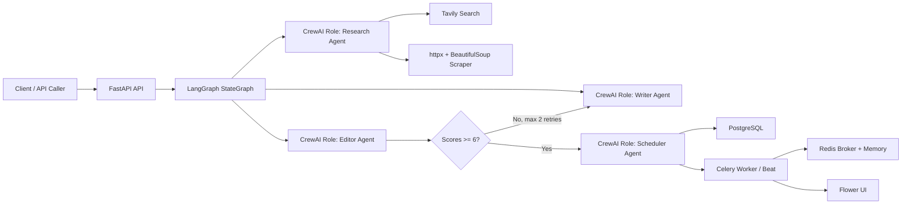

# Autonomous Agentic AI Content Pipeline

Autonomous Agentic AI Content Pipeline is a production-oriented Python system that researches topics from the web, synthesizes source material, drafts long-form articles, edits for quality and SEO, and schedules publication without human intervention after a run is triggered. It combines LangGraph state-machine orchestration with CrewAI role definitions, Groq LLM inference, Tavily web search, async PostgreSQL persistence, Redis-backed memory, and Celery scheduling.

The project is designed to be resume-ready: it demonstrates agentic decision-making through a conditional quality retry loop, non-blocking FastAPI and SQLAlchemy async I/O, production task queues, structured JSON logging, Dockerized service orchestration, and observability through Flower.

## Architecture



## Tech Stack

| Layer | Technology |
|---|---|
| Agent Orchestration | LangGraph state machine + CrewAI agent roles |
| LLM Backend | Groq API, default `llama-3.3-70b-versatile` |
| Web Search Tool | Tavily API |
| Task Queue | Celery + Redis |
| API Layer | FastAPI |
| Frontend | React + Vite, served by FastAPI |
| Database | PostgreSQL via async SQLAlchemy |
| Caching / Memory | Redis |
| Config / Secrets | pydantic-settings + `.env` |
| Testing | pytest + pytest-asyncio |
| Containerization | Docker + docker-compose |
| Dependency Mgmt | Poetry |

## Prerequisites

- Docker and Docker Compose
- Python 3.11 if running locally outside Docker
- Poetry if running locally outside Docker
- Groq API key
- Tavily API key

## Quick Start

```bash
cp .env.example .env
# Edit .env and add GROQ_API_KEY and TAVILY_API_KEY
docker compose build
docker compose up -d
curl -X POST http://localhost:8000/pipeline/run -H "Content-Type: application/json" -d '{"topic":"future of renewable energy","async":false}'
```

The interactive dashboard is available at `http://localhost:8000/app`. API docs are available at `http://localhost:8000/docs`. Flower is available at `http://localhost:5555`.

## API Reference

### Health

```bash
curl http://localhost:8000/health
```

Response:

```json
{"status":"ok","redis":true,"db":true,"celery":true}
```

### Run Pipeline Asynchronously

```bash
curl -X POST http://localhost:8000/pipeline/run \
  -H "Content-Type: application/json" \
  -d '{"topic":"future of renewable energy","async":true}'
```

Response:

```json
{"task_id":"<celery-task-id>","status":"queued"}
```

### Run Pipeline Synchronously

```bash
curl -X POST http://localhost:8000/pipeline/run \
  -H "Content-Type: application/json" \
  -d '{"topic":"future of renewable energy","async":false}'
```

Response: full `PipelineState`, including research, draft, edited content, metadata, publish status, and step history.

### Check Pipeline Task Status

```bash
curl http://localhost:8000/pipeline/status/<celery-task-id>
```

### List Content

```bash
curl "http://localhost:8000/content?status=scheduled&limit=20&offset=0"
```

### Get Content By ID

```bash
curl http://localhost:8000/content/<content-id>
```

### Soft Delete Content

```bash
curl -X DELETE http://localhost:8000/content/<content-id>
```

## Environment Variables

| Variable | Required | Default | Description |
|---|---:|---|---|
| `GROQ_API_KEY` | Yes |  | Groq API key |
| `GROQ_MODEL` | No | `llama-3.3-70b-versatile` | Groq model ID used by LangChain and CrewAI |
| `TAVILY_API_KEY` | Yes |  | Tavily web search API key |
| `REDIS_URL` | No | `redis://localhost:6379` | Redis URL for memory and health checks |
| `DATABASE_URL` | Yes |  | Async SQLAlchemy PostgreSQL URL |
| `CELERY_BROKER_URL` | Yes |  | Celery broker Redis URL |
| `CELERY_RESULT_BACKEND` | No | `redis://localhost:6379/2` | Celery result backend URL |
| `LOG_LEVEL` | No | `INFO` | Logging level |
| `MAX_RESEARCH_SOURCES` | No | `5` | Max Tavily results per query and scrape enrichment cap |
| `CONTENT_PUBLISH_INTERVAL_HOURS` | No | `6` | Publication spacing for scheduled content |

## How To Add A New Agent

1. Create `app/agents/my_agent.py`.
2. Define a `PROMPTS` dictionary at the top of the file.
3. Subclass `BaseAgent` and implement `async def run(self, state: PipelineState) -> PipelineState`.
4. Update `app/agents/orchestrator.py` to instantiate the agent, add a node, and connect it with `add_edge` or `add_conditional_edges`.
5. Add tests in `tests/test_agents.py` using a mocked LLM and memory object.

Minimal agent shape:

```python
class MyAgent(BaseAgent):
    async def run(self, state: PipelineState) -> PipelineState:
        async def operation() -> PipelineState:
            output = await self._call_llm(PROMPTS["my_prompt"].format(topic=state["topic"]))
            state["metadata"]["my_output"] = output
            state["step_history"].append("my_agent")
            return state

        return await self._run_with_logging(state, "my_agent", operation)
```

## Running Tests

```bash
poetry install
poetry run pytest tests/ -v --cov=app
```

## Project Structure

```text
app/main.py                     FastAPI application entrypoint
app/config.py                   pydantic-settings configuration
app/agents/                     LangGraph and CrewAI-backed agent implementations
app/tools/                      Tavily, scraper, and Redis memory wrappers
app/models/                     Pipeline state and SQLAlchemy ORM models
app/api/routes/                 Pipeline, content, and health endpoints
app/tasks/celery_tasks.py       Celery worker, beat, and publish tasks
app/db/session.py               Async SQLAlchemy engine and sessions
app/utils/                      Structured logging and retry helpers
frontend/src/                   React, TypeScript, Tailwind dashboard source
tests/                          Mocked unit and API tests
```

## Operational Notes

- Tables are created automatically on API startup in development and Docker runs.
- Redis is used both as Celery infrastructure and short-term agent memory.
- The editor performs grammar, structure, and SEO passes, then scores readability, SEO, and engagement. Scores below 6 trigger a bounded rewrite path.
- Published content is currently marked as published by Celery; replacing this with a CMS webhook is isolated to `publish_content_task`.
